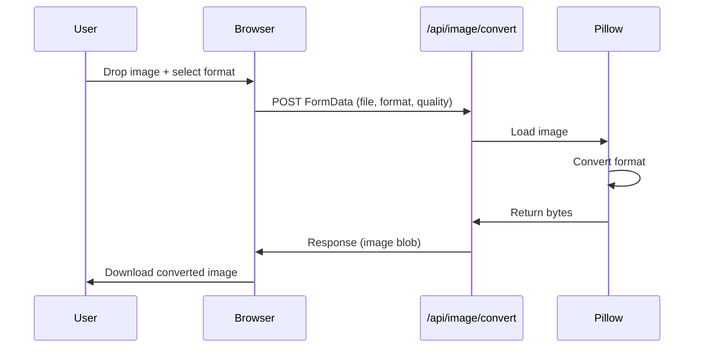
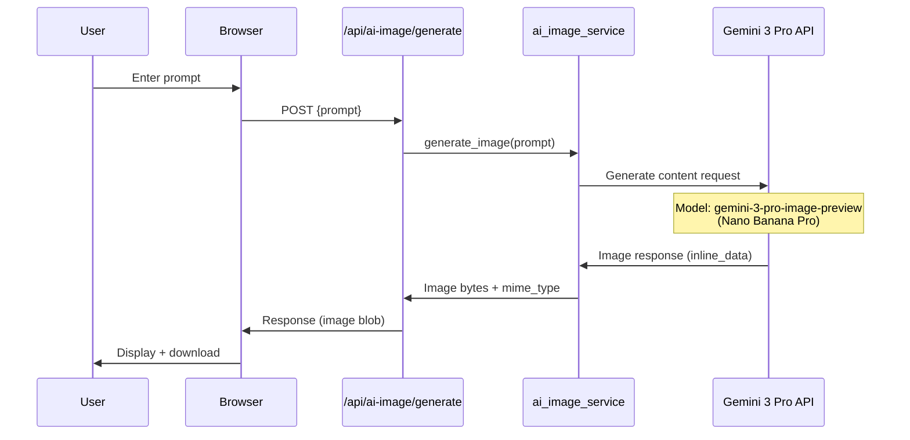
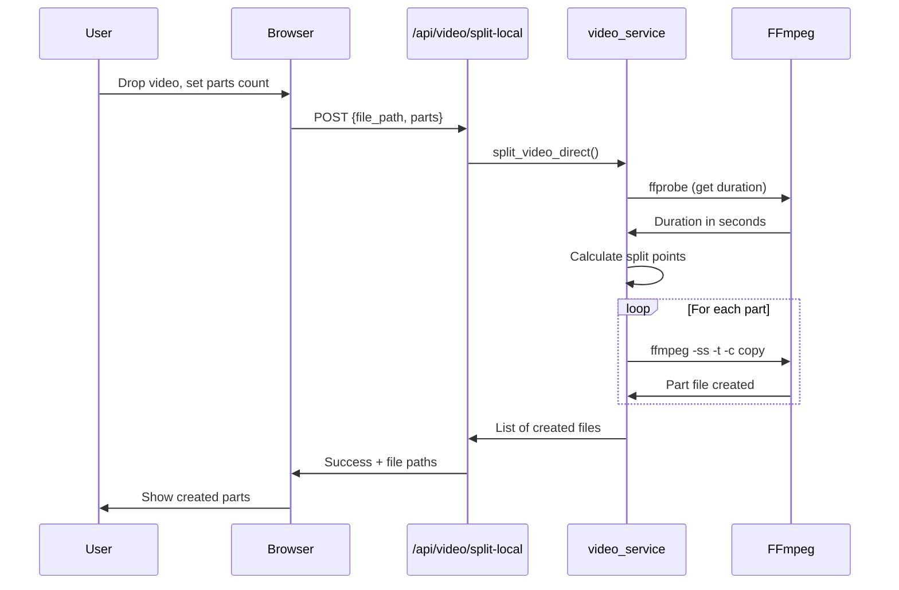

# Media Toolkit

A sleek, local web application for media processing - your personal Swiss Army knife for images, PDFs, audio, and video.


## Features

| Feature | Description |
|---------|-------------|
| **Image Conversion** | Convert between PNG, JPG, WEBP, GIF, BMP, TIFF, HEIC formats with quality control |
| **PDF Tools** | Merge multiple PDFs or split/extract specific pages |
| **Audio Extraction** | Extract audio from videos (MP3, AAC, WAV, FLAC, OGG) with bitrate options |
| **Video Splitting** | Split videos into N equal parts using FFmpeg |
| **AI Image Editor** | Generate and edit images using Google's Gemini 3 Pro (Nano Banana) |

## Architecture

```mermaid
graph TB
    subgraph "Frontend (Browser)"
        UI[Web UI<br/>HTML/CSS/JS]
        JS[Feature Modules<br/>image.js, pdf.js, etc.]
    end

    subgraph "Backend (FastAPI)"
        API[FastAPI Server<br/>:8000]

        subgraph "Routers"
            R1[/api/image/*]
            R2[/api/pdf/*]
            R3[/api/audio/*]
            R4[/api/video/*]
            R5[/api/ai-image/*]
        end

        subgraph "Services"
            S1[image_service.py<br/>Pillow]
            S2[pdf_service.py<br/>pypdf]
            S3[audio_service.py<br/>FFmpeg]
            S4[video_service.py<br/>FFmpeg]
            S5[ai_image_service.py<br/>Gemini API]
        end
    end

    subgraph "External"
        FFMPEG[FFmpeg<br/>CLI Tool]
        GEMINI[Google Gemini API<br/>Nano Banana Pro]
    end

    UI --> JS
    JS -->|HTTP| API
    API --> R1 & R2 & R3 & R4 & R5
    R1 --> S1
    R2 --> S2
    R3 --> S3
    R4 --> S4
    R5 --> S5
    S3 & S4 --> FFMPEG
    S5 -->|REST| GEMINI
```

## How Each Feature Works

### Image Conversion Flow



### AI Image Generation Flow



### Video Splitting Flow



## Project Structure

```
media-toolkit/
├── app/
│   ├── main.py              # FastAPI app entry point
│   ├── config.py            # Environment configuration
│   ├── routers/
│   │   ├── image.py         # Image conversion endpoints
│   │   ├── pdf.py           # PDF merge/split endpoints
│   │   ├── audio.py         # Audio extraction endpoints
│   │   ├── video.py         # Video splitting endpoints
│   │   └── ai_image.py      # AI image generation endpoints
│   └── services/
│       ├── image_service.py    # Pillow image processing
│       ├── pdf_service.py      # pypdf operations
│       ├── audio_service.py    # FFmpeg audio extraction
│       ├── video_service.py    # FFmpeg video splitting
│       └── ai_image_service.py # Gemini API integration
├── static/
│   ├── css/
│   │   └── styles.css       # Dark theme styles
│   └── js/
│       ├── main.js          # Navigation & utilities
│       ├── image.js         # Image conversion UI
│       ├── pdf.js           # PDF tools UI
│       ├── audio.js         # Audio extraction UI
│       ├── video.js         # Video splitting UI
│       └── ai-image.js      # AI image editor UI
├── templates/
│   └── index.html           # Single-page application
├── uploads/                 # Temporary upload storage
├── outputs/                 # Temporary output storage
├── .env                     # API keys (git-ignored)
├── .env.example             # Template for .env
├── .gitignore
├── requirements.txt
└── README.md
```

## Quick Start

### Prerequisites

- **Python 3.9+**
- **FFmpeg** (for audio/video processing)
- **Google API Key** (for AI features)

### Installation

1. **Clone the repository**
   ```bash
   git clone https://github.com/yourusername/media-toolkit.git
   cd media-toolkit
   ```

2. **Create virtual environment**
   ```bash
   python -m venv venv
   source venv/bin/activate  # On Windows: venv\Scripts\activate
   ```

3. **Install dependencies**
   ```bash
   pip install -r requirements.txt
   ```

4. **Install FFmpeg** (if not already installed)
   ```bash
   # macOS
   brew install ffmpeg

   # Ubuntu/Debian
   sudo apt install ffmpeg

   # Windows (using chocolatey)
   choco install ffmpeg
   ```

5. **Configure environment**
   ```bash
   cp .env.example .env
   # Edit .env and add your Google API key
   ```

6. **Run the server**
   ```bash
   uvicorn app.main:app --reload --host 127.0.0.1 --port 8000
   ```

7. **Open in browser**
   ```
   http://127.0.0.1:8000
   ```

## Configuration

### Environment Variables

| Variable | Description | Required |
|----------|-------------|----------|
| `GOOGLE_API_KEY` | Google AI Studio API key for Gemini | Yes (for AI features) |

### Getting a Google API Key

1. Go to [Google AI Studio](https://aistudio.google.com/apikey)
2. Sign in with your Google account
3. Click "Create API Key"
4. Copy the key to your `.env` file

## API Reference

### Image Conversion

```http
POST /api/image/convert
Content-Type: multipart/form-data

file: <image file>
output_format: png|jpg|webp|gif|bmp|tiff
quality: 1-100 (for jpg/webp)
```

### PDF Merge

```http
POST /api/pdf/merge
Content-Type: multipart/form-data

files: <pdf files>
```

### PDF Split

```http
POST /api/pdf/split
Content-Type: multipart/form-data

file: <pdf file>
mode: all|range
pages: "1,3,5-7" (if mode=range)
```

### Audio Extraction

```http
POST /api/audio/extract
Content-Type: multipart/form-data

file: <video file>
format: mp3|aac|wav|flac|ogg
bitrate: 64|128|192|256|320
```

### Video Split (Local)

```http
POST /api/video/split-local
Content-Type: application/x-www-form-urlencoded

file_path: /path/to/video.mp4
parts: 2-20
```

### AI Image Generate

```http
POST /api/ai-image/generate
Content-Type: multipart/form-data

prompt: "A beautiful sunset over mountains"
```

### AI Image Edit

```http
POST /api/ai-image/edit
Content-Type: multipart/form-data

file: <image file>
prompt: "Make the sky more colorful"
```

## Tech Stack

| Layer | Technology |
|-------|------------|
| **Backend** | FastAPI (Python) |
| **Frontend** | Vanilla HTML/CSS/JavaScript |
| **Image Processing** | Pillow, pillow-heif |
| **PDF Processing** | pypdf |
| **Audio/Video** | FFmpeg (via subprocess) |
| **AI** | Google Gemini 3 Pro Image API |
| **Styling** | Custom dark theme CSS |

## Security Notes

- All processing happens **locally** on your machine
- Files are **never uploaded** to external servers (except AI features which use Google's API)
- The `.env` file containing API keys is **git-ignored**
- Temporary files in `uploads/` and `outputs/` should be periodically cleaned

## Troubleshooting

### "Google API key not configured"
- Ensure `.env` file exists with `GOOGLE_API_KEY=your-key`
- Restart the server after adding the key

### FFmpeg not found
- Verify FFmpeg is installed: `ffmpeg -version`
- Ensure it's in your system PATH

### Video splitting fails
- Check the video path is absolute and file exists
- Ensure FFmpeg can read the video format

## License

MIT License - feel free to use, modify, and distribute.

## Contributing

Contributions welcome! Please open an issue or submit a pull request.

---

Built with FastAPI and Gemini AI
